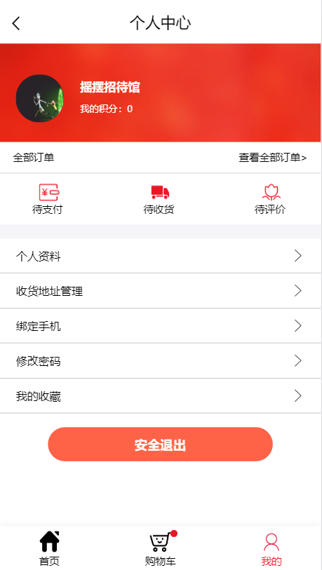

## E-commerce 仿天猫电商App（移动端）

* [预览链接](http://123.57.24.197/)

使用react创建的一套模仿天猫的电商APP页面

1、基于react的单页面应用 
2、模拟正常线上购物的流程：浏览商品、选购商品、加入购物车、确认订单等 
3、自己创建的搜索组件，能够通过关键词搜索相关商品并创建本地搜索历史 
4、模拟用户中心，用户能够正常注册登录并使用登录后的修改资料、查看订单等功能 

## 效果图

  

## 安装使用

下载到本地后，使用npm install即可安装使用
